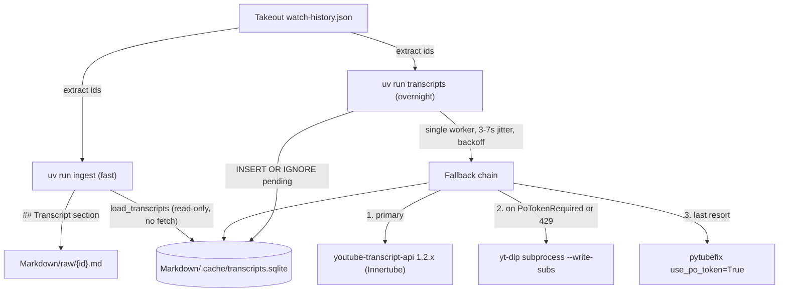

## Add transcripts to watch-history markdown

Mirror the existing [src/youtubebrain/descriptions.py](src/youtubebrain/descriptions.py) seam — a cache module with a fast read API the ingest writer consumes, plus a long-running fetcher invoked as its own CLI command. Storage becomes SQLite (research recommendation) since 14,698 entries + raw timed JSON outgrow a single JSON file and a status column is needed for resumability and crash recovery.

### Architecture



The fetcher and the markdown writer are decoupled: a stalled overnight run never blocks `uv run ingest`, and re-running ingest after each night folds whatever new transcripts are in the DB into the markdown files. The DB is the source of truth; the markdown is a rendered view.

### New module: `src/youtubebrain/transcripts.py`

Public surface, designed to mirror [src/youtubebrain/descriptions.py](src/youtubebrain/descriptions.py):

- `TRANSCRIPTS_DB_PATH = Path("Markdown/.cache/transcripts.sqlite")`
- `init_db(db_path) -> None` — create schema + WAL mode.
- `enqueue(video_ids, db_path) -> None` — `INSERT OR IGNORE` rows with `status='pending'`.
- `fetch_transcripts(db_path) -> None` — the overnight loop; pure side-effect on the DB. Implements the research's recommended pacing and fallback chain.
- `load_transcripts(video_ids, db_path) -> dict[str, str | None]` — fast read-only lookup used by ingest's markdown writer; returns plain-text transcript or `None` when status != `ok`.

Schema (per research §4.3 / §6.3):

```sql
CREATE TABLE transcripts (
    video_id      TEXT PRIMARY KEY,
    status        TEXT NOT NULL,    -- pending|ok|no_captions|unavailable|
                                    -- age_restricted|needs_pot|blocked|error
    language      TEXT,
    is_generated  INTEGER,
    text          TEXT,             -- joined plain text (what ingest renders)
    raw_json      TEXT,             -- to_raw_data() JSON (timings preserved)
    source        TEXT,             -- 'yta'|'yt-dlp'|'pytubefix'
    error_message TEXT,
    attempts      INTEGER DEFAULT 0,
    fetched_at    TIMESTAMP,
    last_attempt  TIMESTAMP
);
CREATE INDEX idx_status ON transcripts(status);
```

### Fallback chain (full, per user choice)

Implemented as three functions in `transcripts.py`, called in order until one returns `ok`:

1. **`_fetch_yta(video_id)`** — primary. Uses [youtube-transcript-api](https://pypi.org/project/youtube-transcript-api/) `>=1.2.4`. UA rotation + jittered `requests.Session` recycled every ~300 calls. Maps exceptions to status per research §4.5:
   - `TranscriptsDisabled`/`NoTranscriptFound` (after translate fallback) → `no_captions`
   - `VideoUnavailable` → `unavailable`
   - `AgeRestricted` → continue to step 2
   - `PoTokenRequired` → continue to step 2
   - `RequestBlocked`/`IpBlocked`/`TooManyRequests` → raise `BlockedError` (handled by loop, never falls through to fallback)
   - `CouldNotRetrieveTranscript` → `error` (retried)
2. **`_fetch_ytdlp(video_id)`** — second pass. Shells out to the `yt-dlp` binary into a `tempfile.TemporaryDirectory`, parses the resulting JSON3 file, joins the events into plain text. Auto-detects a local bgutil pot provider on `127.0.0.1:4416` (no requirement, just used if present). Args follow research §6.4:
   ```
   yt-dlp --skip-download --write-auto-subs --write-subs
          --sub-langs "en,en-US,en-GB" --sub-format "json3/vtt/best"
          --sleep-requests 1.5 --sleep-subtitles 3
          --extractor-args "youtube:player_client=tv,mweb"
          -o "<tmp>/%(id)s.%(ext)s" <video_id>
   ```
3. **`_fetch_pytubefix(video_id)`** — last resort. `pytubefix.YouTube(url, use_po_token=True).captions['a.en'].xml_captions`, then strip XML to plain text.

### Pacing and resilience (research §6.4 defaults)

- Inter-video delay `random.uniform(3, 7)`; long pause `random.uniform(60, 120)` every 500 successful fetches.
- Single worker — no `ThreadPoolExecutor`.
- `BACKOFFS = [300, 900, 2700, 7200]` seconds on consecutive `BlockedError`; abort the run after exhausting them so the IP recovers.
- Max 5 attempts per video. SELECT loop:
  ```sql
  SELECT video_id FROM transcripts
   WHERE status IN ('pending','blocked','error') AND attempts < 5
   ORDER BY attempts ASC, RANDOM() LIMIT 1
  ```
- Commit after every row (durability over write cost — wall time is gated by network, not SQLite).
- `PRAGMA journal_mode=WAL` so the read-only `load_transcripts()` from `ingest` never blocks an in-progress fetcher.

### Markdown writer change

[src/youtubebrain/ingest.py](src/youtubebrain/ingest.py) `_render_markdown` gains an optional `transcript: str | None` argument and a new section, appended after Description:

```
## Transcript

<plain text>     # or  _(unavailable)_
```

`main()` calls `load_transcripts(ids)` after `fetch_descriptions(ids)` and passes both into `write_markdown`. Since `load_transcripts` is a fast SQLite read, this stays a quick command. Re-running `uv run ingest` after each night of fetching is the rendering step.

### CLI entry: `uv run transcripts`

New script in [pyproject.toml](pyproject.toml) `[project.scripts]`:

```
transcripts = "youtubebrain.transcripts:main"
```

`main()`:
1. `load_watch_history(WATCH_HISTORY_PATH)` (reuse from ingest) → extract IDs.
2. `init_db()`, `enqueue(ids)`.
3. `fetch_transcripts()` (the long loop). Logs progress every video and a summary every 100.

A separate command (not folded into `ingest`) because the overnight run must not block normal markdown regeneration and may be aborted/resumed many times.

### Dependencies — [pyproject.toml](pyproject.toml)

Add to `[project.dependencies]`:

- `youtube-transcript-api>=1.2.4`
- `pytubefix>=10.6`
- `yt-dlp>=2026.01` (installed for the Python API but used via subprocess to keep error handling simple)

No SQLAlchemy — stdlib `sqlite3` is sufficient and matches the project's "thin layer" style.

### Tests — `tests/test_transcripts.py`

Patch the library entry points instead of doing HTTP mocking (the youtube-transcript-api 1.2.x Innertube flow is awkward to mock; the descriptions tests use respx because they hit a documented REST API).

Spec sections to add to `lat.md/transcripts.md` (and corresponding `# @lat:` comments in tests):

- Schema initialised and pending rows inserted idempotently
- `load_transcripts` returns `None` for non-`ok` statuses
- `load_transcripts` returns text for `ok` rows
- Primary success path stores text + raw_json + `source='yta'`
- `TranscriptsDisabled` marks `no_captions` and never retries
- `VideoUnavailable` marks `unavailable`
- `RequestBlocked` raises `BlockedError`, increments attempts, triggers backoff
- 3 consecutive blocks aborts the run
- `PoTokenRequired` falls through to yt-dlp
- yt-dlp fallback parses JSON3 into plain text
- pytubefix fallback runs only after yt-dlp fails
- Attempts cap at 5
- Markdown writer renders `## Transcript` section and `_(unavailable)_` placeholder

Sleeps inside the loop are pulled out to a `_sleep` indirection that tests monkeypatch to no-op.

### Documentation — `lat.md/`

- New file `lat.md/transcripts.md` describing the module, fallback chain, schema, pacing, failure-mode handling, and every test spec above (per the lat.md skill rules — leading paragraph ≤ 250 chars, frontmatter `require-code-mention: true`).
- Update [lat.md/lat.md](lat.md/lat.md) to add `[[transcripts]]` next to `[[ingest]]` and `[[descriptions]]`.
- Update [lat.md/ingest.md](lat.md/ingest.md) `## Markdown writer` to mention the new `## Transcript` section, with a `[[transcripts#API client]]` wiki link.
- Run `lat check` at the end and fix any reported errors.

### Out of scope (deliberate)

- IPv6 / phone-tether parallelisation (research §3.7) — single-IP overnight is the stated constraint.
- bgutil-ytdlp-pot-provider Docker setup — yt-dlp auto-detects it on `127.0.0.1:4416` if the user spins it up later; nothing in our code needs to change.
- Cookie auth — neither youtube-transcript-api (currently disabled, PR #565 open) nor a throwaway-account flow. Age-restricted videos go straight to `age_restricted` status and rely on later manual yt-dlp `--cookies-from-browser` runs if the user opts in.
