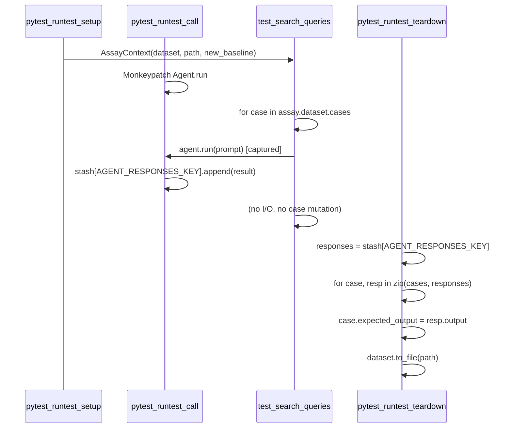

# Automatic Assay Baseline Serialization

## Goal

Make the assay plugin behave like `pytest-recording`: the test runs the agent, and the plugin automatically writes the updated dataset in teardown—without the test performing any I/O or manual case updates.

## Current Flow

1. **Setup**: Plugin loads dataset, injects `AssayContext` with `assay.dataset`
2. **Call**: Plugin intercepts `Agent.run()`, appends each `AgentRunResult` to `item.stash[AGENT_RESPONSES_KEY]`
3. **Test body**: Iterates cases, calls `agent.run()` per case, builds `cases_new`, then does `assay.dataset.cases.clear()` and `assay.dataset.cases.extend(cases_new)`
4. **Teardown**: Plugin serializes `assay.dataset.to_file(assay.path)` when `assay_mode == "new_baseline"`

## Proposed Flow

1. **Setup**: Unchanged
2. **Call**: Unchanged (responses already captured)
3. **Test body**: Only iterates cases and calls `agent.run()`—no case construction or mutation
4. **Teardown**: Plugin merges `AGENT_RESPONSES_KEY` into `assay.dataset.cases`, then serializes

## Implementation

### 1. Modify `pytest_runtest_teardown` in [plugin.py](src/youtubebrain/plugin.py)

When `assay_mode == "new_baseline"`, before serializing:

- Retrieve `responses = item.stash.get(AGENT_RESPONSES_KEY, [])`
- Retrieve `cases = assay.dataset.cases`
- **Validation**: If `len(responses) != len(cases)`, log an error and skip serialization (or raise `AssertionError` to match evaluator behavior)
- **Merge**: For each `(case, response)` pair in `zip(cases, responses, strict=True)`:
  - Set `case.expected_output = response.output if response.output is not None else ""`
- **Serialize**: Call `assay.dataset.to_file(assay.path, schema_path=None)` as today

Key code location: lines 276–296 in `plugin.py`. The merge logic is inserted before the existing `to_file` call.

### 2. Simplify [test_curiosity.py](tests/test_curiosity.py) `test_search_queries`

Remove:

- The `cases_new` list and its construction
- The `Case(name=..., inputs=..., expected_output=result.output)` creation inside the loop
- The `assay.dataset.cases.clear()` and `assay.dataset.cases.extend(cases_new)` block

The loop becomes:

```python
for case in assay.dataset.cases:
    logger.info(f"Case {case.name} with topic: {case.inputs['topic']}")
    prompt = (...)
    async with query_agent:
        result = await query_agent.run(user_prompt=prompt, model_settings=...)
    logger.debug(f"Generated query: {result.output}")
```

No `case_new`, no `cases_new`, no mutation of `assay.dataset`. The plugin handles everything in teardown.

### 3. Update plugin tests in [test_plugin.py](tests/test_plugin.py)

`**test_pytest_runtest_teardown_new_baseline_mode**` (lines 609–644):

- Currently passes a dataset with pre-populated `expected_output`-like data in `inputs["query"]`
- Must be updated to populate `item.stash[AGENT_RESPONSES_KEY]` with mock `AgentRunResult` objects whose `output` matches the expected serialized values
- The dataset cases should have empty or placeholder `expected_output`; the teardown will overwrite them from the stash
- Verify reloaded dataset has correct `expected_output` values from the mock responses

`**test_full_assay_workflow_with_topic_generation**` (lines 1290–1370):

- Currently simulates the workflow without `Agent.run()` interception—manually builds `cases_new` and mutates `assay.dataset`
- Must be updated to simulate the capture: either (a) populate `item.stash[AGENT_RESPONSES_KEY]` with mock responses before teardown, or (b) run through `pytest_runtest_call` with a mock `Agent.run` that appends to the stash
- Simplest: after setup, manually add mock `AgentRunResult` objects to `mock_item.stash[AGENT_RESPONSES_KEY]` with `output="search for: {topic}"`, then call teardown
- Remove the manual `assay_ctx.dataset.cases.clear()` / `extend(cases_new)` and the `case_new` construction; the test should only simulate that the agent was run (by populating the stash), then teardown does the rest

### 4. Edge Cases


| Scenario                       | Handling                                                                          |
| ------------------------------ | --------------------------------------------------------------------------------- |
| `response.output is None`      | Use `""` for `expected_output` (or keep original; recommend `""` for consistency) |
| `len(responses) != len(cases)` | Log error, skip serialization, optionally raise `AssertionError`                  |
| Empty `responses`              | Same as count mismatch—skip or warn                                               |
| Non-assay / `evaluate` mode    | No change; teardown skips as today                                                |


## Data Flow (Mermaid)




## Files to Change

- [src/youtubebrain/plugin.py](src/youtubebrain/plugin.py): Add merge logic in `pytest_runtest_teardown`
- [tests/test_curiosity.py](tests/test_curiosity.py): Remove manual case construction and mutation
- [tests/test_plugin.py](tests/test_plugin.py): Update `test_pytest_runtest_teardown_new_baseline_mode` and `test_full_assay_workflow_with_topic_generation` to use `AGENT_RESPONSES_KEY` and verify automatic serialization

