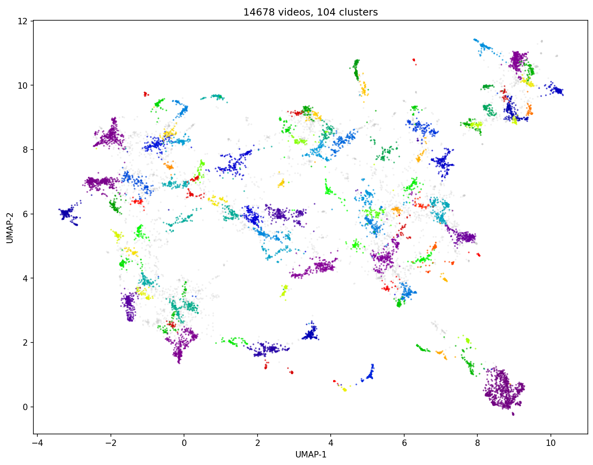

## YouTubeBrain

YouTubeBrain generates a markdown knowledge base from your watched YouTube videos. Any agent can connect to it via MCP.

### Exporting your watch history

The steps below read `Takeout/YouTube and YouTube Music/history/watch-history.json` at the repo root. To produce it:

1. Open [takeout.google.com](https://takeout.google.com) and click **Deselect all**.
2. Select **YouTube and YouTube Music** → **All YouTube data included** → **Deselect all** → enable only **history**.
3. Click **Multiple formats** and set **History** to **JSON**.
4. Submit the export, wait for the email (~20 minutes), and download the ZIP.
5. Unzip it and copy the `Takeout/` folder into the root of this repo. The final path must be `Takeout/YouTube and YouTube Music/history/watch-history.json`.

### Configuration

Two env files, scoped by pipeline stage:

```bash
cp .env.example .env        # steps 1–6 (Python pipeline)
cp .env.pi.example .env.pi  # step 7 (Pi wiki sandbox)
```

Edit `.env` with your YouTube API key, LLM provider, and embedding settings. Edit `.env.pi` with your OpenRouter API key (used only by the Docker sandbox in step 7).

### Run the pipeline

Eight steps in the order below. `ingest` is run twice — once to seed the descriptions cache the summarizer needs, then again to fold transcripts and summaries into the raw markdown the embedder reads. Steps 1–6 are the Python pipeline (see this [overview](lat.md/overview.md) for the full diagram, per-stage prerequisites, and output files); step 7 compiles the wiki (see [wiki](lat.md/wiki.md)); step 8 (optional) indexes the wiki for local search (see [search](lat.md/search.md)).

```bash
uv run ingest
uv run transcripts
uv run summaries
uv run ingest
uv run embed
uv run cluster
./compile-wiki.sh
./index-wiki.sh
```

1. `uv run ingest` — fetch descriptions (YouTube Data API), write initial `Markdown/raw/<id>.md` with placeholder Summary / Transcript sections.
2. `uv run transcripts` — long-running, throttled, resumable caption fetch into `Markdown/.cache/transcripts.sqlite`. If rows are marked `blocked` after IP throttling, reset them to `pending` or `error` (or delete) before the next run.
3. `uv run summaries` — long-running LLM summarizer; reads descriptions + transcripts, writes `Markdown/.cache/summaries.sqlite`.
4. `uv run ingest` — second pass; rewrites `Markdown/raw/<id>.md` with the now-cached transcripts and summaries folded in.
5. `uv run embed` — local SentenceTransformer encoding into `Markdown/embeddings/`.
6. `uv run cluster` — BERTopic (UMAP + HDBSCAN) over the embedding store with LLM-named topics; writes `Markdown/clustering/`, `Markdown/wiki/topics/` (wipe-and-rewrite), and `Markdown/wiki/creators/` (preserve-existing stub pages).
7. `./compile-wiki.sh` — runs the [Pi agent](https://pi.dev) in a Docker sandbox to enrich each seeded `Markdown/wiki/topics/` page into a full synthesis (`fill-topic` skill). Requires Docker and `.env.pi` (from `.env.pi.example`). Do not re-run `cluster` after this, or enriched pages are wiped.
8. `./index-wiki.sh` — indexes curated wiki pages into a repo-local [qmd](https://github.com/tobi/qmd) search DB and exposes them via MCP. Requires qmd (`npm install -g @tobilu/qmd@2.1.0`). First run downloads an embedding model; on a large corpus `qmd embed` runs in repeated ~30-min passes until nothing is pending. Re-run after `./compile-wiki.sh` or manual wiki edits.

### Search wiki with the `qmd` CLI

Once steps 1–8 have run, you can query the curated wiki from the host with the `qmd` CLI. Set `XDG_CACHE_HOME=$PWD/.qmd` so qmd reads the repo-local index, and scope to the `youtubebrain-wiki` collection with `-c`. Two modes: `qmd query` (hybrid — BM25 + vector + LLM rerank, best quality) and `qmd search` (fast BM25 keywords, no LLM). Each hit is a wiki page that links out to its source videos.

```bash
# Hybrid natural-language search (recommended) — "which watched videos cover this?"
XDG_CACHE_HOME=$PWD/.qmd qmd query "anglo-saxon migration to Britain" -c youtubebrain-wiki

# Fast keyword search, listing matching pages as docid,score,path,context
XDG_CACHE_HOME=$PWD/.qmd qmd search "anglo-saxon" -c youtubebrain-wiki -n 5 --files
```

### Search wiki with the `qmd` MCP server

The same `.qmd` index also backs an MCP server (`qmd mcp`, stdio transport), so an AI client can search the wiki as a tool instead of via the CLI. Clients need an **absolute** path — they do not expand editor variables.

**Claude Desktop (macOS):**

1. Run steps 1–8 first so `.qmd/` exists and is embedded.
2. Open the config — Claude Desktop → **Settings → Developer → Edit Config**, or edit `~/Library/Application Support/Claude/claude_desktop_config.json` directly.
3. Add a `qmd` entry under `mcpServers` (merge it with any existing servers):

```json
{
  "mcpServers": {
    "qmd": {
      "command": "/opt/homebrew/bin/qmd",
      "args": ["mcp"],
      "env": {
        "XDG_CACHE_HOME": "/Users/you/Code/youtubebrain/.qmd"
      }
    }
  }
}
```

4. Use **absolute** paths, not the `${workspaceFolder}` form: set `XDG_CACHE_HOME` to your repo's `.qmd` (run `echo "$PWD/.qmd"` in the repo root) and `command` to your `qmd` binary (run `which qmd`). The GUI app launches with a minimal `PATH`, so a bare `qmd` is often not found.
5. Fully quit Claude Desktop (**Cmd+Q**, not just close the window) and reopen it. The `qmd` search tools then appear in the app's MCP/tools menu.
<br><br><br>

*Clusters of watched YouTube videos.*