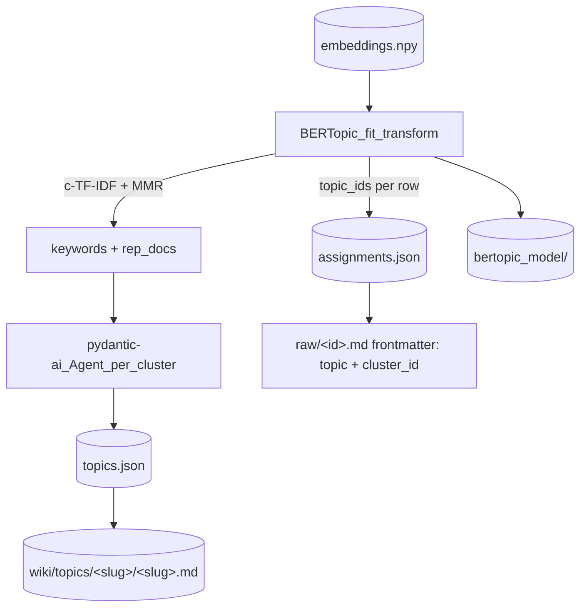

---
lat:
  require-code-mention: true
---
# Clusters

Groups the embedding store under `Markdown/embeddings/` into named topic clusters using deterministic UMAP + HDBSCAN via BERTopic, then names each cluster with one LLM call per cluster.

This stage consumes the `(embeddings.npy, ids.json, meta.json)` trio produced by [[embeddings]] and writes the cluster trio `(assignments.json, topics.json, meta.json)` plus a persisted `bertopic_model/` under `Markdown/clustering/`. Labelling is decoupled from the fit: BERTopic uses only deterministic `KeyBERTInspired + MaximalMarginalRelevance` representations during `fit_transform`, and an asyncio-bounded second pass calls a pydantic-ai agent (configured via the project-wide `PROVIDER`/`MODEL` env vars) per cluster.

## CLI entry

[[src/youtubebrain/clusters.py#main]] is the `uv run cluster` entry point; it calls [[src/youtubebrain/clusters.py#cluster_all]] and logs the resulting cluster count.

Pipeline order is documented in [[overview#Run order]] — `cluster` is always the last step and must follow a successful `embed`. The command is idempotent against unchanged embeddings but always retrains the model (see [[clusters#Re-cluster policy]]); cluster ids are therefore not stable across runs.

## Storage layout

[[src/youtubebrain/clusters.py#save_atomic]] writes four artefacts under `Markdown/clustering/`: `assignments.json` (a JSON list of int cluster ids row-aligned to `ids.json`, `-1` for outliers), `topics.json` (a list of [[src/youtubebrain/clusters.py#TopicInfo]]), `meta.json`, and the `bertopic_model/` directory.

Atomic write protocol mirrors [[embeddings#Storage layout]]: each json file is written to a `*.tmp` sibling then `os.replace`-d into place in order assignments → topics → meta. The BERTopic model is saved to a sibling `bertopic_model.tmp/` directory, then the existing `bertopic_model/` is removed and the tmp directory replaced into place. A failing mid-write step never leaves `*.tmp` siblings — [[src/youtubebrain/clusters.py#save_atomic]]'s `finally` block sweeps them up. [[src/youtubebrain/clusters.py#load_existing]] reads the trio back; any schema mismatch is logged and treated as empty so the next run rebuilds cleanly. The BERTopic model is persisted with `prediction_data=True` so a future Phase 5 `partial_fit` over new embedding rows is unblocked.

## Pipeline components

[[src/youtubebrain/clusters.py#_build_umap]], [[src/youtubebrain/clusters.py#_build_hdbscan]], and [[src/youtubebrain/clusters.py#_build_topic_model]] each lazy-import their heavy dependency so the default test run never touches `umap-learn`, `hdbscan`, or `bertopic`.

UMAP runs with `metric="cosine"`, `n_components=5`, `n_neighbors=15`, `min_dist=0.0`, `random_state=42` — the random state is the only knob that makes the reduction deterministic and is recorded in `meta.json`. HDBSCAN runs `metric="euclidean"` on UMAP output (cosine is no longer meaningful after the reduction), `cluster_selection_method="eom"`, `min_samples=5`, and `prediction_data=True`. BERTopic stitches them together with the representation pipeline `{"Main": [KeyBERTInspired(), MaximalMarginalRelevance(diversity=0.3)]}`, `calculate_probabilities=False`, and `verbose=True`. The SentenceTransformer name from `embeddings/meta.json.model` is forwarded into BERTopic as `embedding_model=...` because `KeyBERTInspired` re-embeds *candidate keywords* via that model — passing precomputed document `embeddings=` to `fit_transform` is not enough on its own. After `fit_transform`, [[src/youtubebrain/clusters.py#_extract_cluster_payloads]] pulls `(cluster_id, keywords, rep_texts)` out of the fitted model — see [[clusters#Representative-doc plumbing]].

## Min-cluster-size heuristic

[[src/youtubebrain/clusters.py#_resolve_min_cluster_size]] returns `max(_MIN_SIZE_FLOOR=10, round(sqrt(n_videos)))` so the default scales sensibly from a 517-video test corpus (→ 23) to a 10K target (→ 100) without code change.

`CLUSTER_MIN_SIZE` overrides the heuristic for hand-tuning when the outlier share is too large or the cluster count falls outside the expected band. The run refuses with an actionable error when `len(ids) < 2 * min_cluster_size`, telling the caller to either grow the corpus or lower the override.

## Representative-doc plumbing

[[src/youtubebrain/clusters.py#_load_texts_by_id]] walks `Markdown/raw/` once and reuses [[src/youtubebrain/embeddings.py#parse_raw_markdown]] + [[src/youtubebrain/embeddings.py#compose_text]] to recover the title+summary text that was originally embedded, row-aligned to `ids.json`.

[[src/youtubebrain/clusters.py#_extract_cluster_payloads]] then asks the fitted model for `get_representative_docs(cluster_id)` (text strings) and maps each one back to a video id via an inverse `text → id` dict built before the fit. Outliers (`-1`) receive an empty rep-id list and are skipped during labelling. Missing raw files do not abort the run — the affected cluster simply falls back to keywords-only LLM prompts (see [[clusters#LLM labeller]]).

## LLM labeller

[[src/youtubebrain/clusters.py#_build_label_agent]] constructs a `pydantic_ai.Agent` whose `output_type=TopicLabel` and `system_prompt` is a small fixed instruction; the model itself is taken from [[provider#Model factory]] so the user can pick a cheap cloud model (or stay on Ollama) without touching the cluster code.

[[src/youtubebrain/clusters.py#_label_clusters]] is the async fan-out: it gathers one `agent.run(...)` per non-outlier cluster behind an `asyncio.Semaphore(LABEL_CONCURRENCY)`. Failures on a single cluster fall back to [[src/youtubebrain/clusters.py#_fallback_label]] (`label = f"topic-{cluster_id}-{first_keyword}"`, `description = ", ".join(keywords[:5])`) so the run still completes and other clusters are unaffected. `LABEL_CONCURRENCY` defaults to 4 — predictable on Ollama, easy to bump for cloud providers.

## Re-cluster policy

Every `uv run cluster` is a full retrain. UMAP geometry is deterministic via `random_state=42`, but HDBSCAN labels clusters by discovery order and LLM labels are non-deterministic, so **cluster ids are not stable across runs**.

Downstream consumers MUST key off the human-readable kebab-case `label` field on [[src/youtubebrain/clusters.py#TopicInfo]] rather than `cluster_id`. The run refuses to overwrite an existing cluster store when `embeddings/meta.json.model` no longer matches the prior `clustering/meta.json.embedding_model` — the old labels are no longer comparable, so the user must delete `Markdown/clustering/` to rebuild.

## Env vars

`PROVIDER` and `MODEL` are reused via [[provider#Model factory]] for the labelling agent — set them to whichever model is cheapest at the time of running.

`CLUSTER_MIN_SIZE` overrides the [[clusters#Min-cluster-size heuristic]]. `LABEL_CONCURRENCY` (default 4) caps the parallel LLM calls during labelling; bump it to 8–16 for cloud providers, drop it to 1–2 for local Ollama.

## Wiki topics

After `save_atomic`, [[src/youtubebrain/clusters.py#write_wiki_topics]] materialises every cluster as a folder + markdown page under `Markdown/wiki/topics/<slug>/<slug>.md` and injects `topic` + `cluster_id` into every `Markdown/raw/<id>.md` frontmatter.

The step runs inline at the end of every `uv run cluster`. It returns `(n_topics_written, n_raw_updated)` and is fail-soft per video — a missing raw file is logged in aggregate and does not abort the run.

### Slug resolution

[[src/youtubebrain/clusters.py#_resolve_slugs]] maps each `cluster_id` to a unique slug.

The non-outlier `TopicInfo.label` is sanitised before being used as a filesystem path: lowercased, runs of non-`[a-z0-9]` collapsed to a single `-`, leading/trailing hyphens stripped, with `topic-{cluster_id}` as fallback for an otherwise-empty result. On collision the second and further occurrences are suffixed `-1`, `-2`, ... in cluster_id ascending order. The outlier cluster (`-1`) always resolves to the literal slug `outliers`.

### Page rendering

[[src/youtubebrain/clusters.py#_render_topic_page]] writes one minimal markdown page per cluster under `Markdown/wiki/topics/<slug>/<slug>.md`.

The page is: YAML frontmatter `{label, cluster_id, count, keywords, representative_ids}` (same `sort_keys=False, allow_unicode=True, default_flow_style=False` style as [[ingest#Markdown writer]]), an H1 of the slug, the LLM description as a paragraph, then a `## Videos` list of `- <title> ([<id>](../../../raw/<id>.md))` lines.

Member titles come from [[src/youtubebrain/clusters.py#_load_titles_by_id]], which reuses [[src/youtubebrain/embeddings.py#parse_raw_markdown]] for one pass over `Markdown/raw/`; ids without a raw file are listed by id only.

### Raw frontmatter contract

[[src/youtubebrain/clusters.py#_inject_topic_into_raw]] sets `topic` and `cluster_id` in every `Markdown/raw/<id>.md` frontmatter, exactly once each, idempotently.

It parses the frontmatter dict via `yaml.safe_load` (which collapses any pre-existing duplicates), overwrites the two keys, and re-dumps with `sort_keys=False` so original key order is preserved. The body after the second `---` fence is written back verbatim. The write is atomic via `*.tmp` + `os.replace`, so a crash leaves either the previous or the new file intact. Re-running with the same `(slug, cluster_id)` is a byte-identical no-op.

Malformed-frontmatter raw files raise `ValueError`. The covered cases are missing or unclosed fences, yaml parse errors, and non-mapping top-level YAML (e.g. a scalar `0`, `False`, or a list) — only an entirely empty frontmatter is treated as `{}`, so a falsy non-mapping value is never silently coerced away. [[src/youtubebrain/clusters.py#write_wiki_topics]] catches these per-file and logs a warning, so one bad raw file does not abort the whole injection pass.

### Wipe-and-rewrite policy

Because cluster ids and LLM labels are not stable across runs (see [[clusters#Re-cluster policy]]), [[src/youtubebrain/clusters.py#write_wiki_topics]] `shutil.rmtree`s `Markdown/wiki/topics/` and recreates it from scratch every run.

Manually edited topic pages will be lost — by design, this layer is fully owned by the cluster step.

## Output schema

[[src/youtubebrain/clusters.py#TopicLabel]] is the pydantic output type the LLM agent must return: a kebab-case 3–6 word `label` and a 3-sentence plain-prose `description`.

[[src/youtubebrain/clusters.py#TopicInfo]] is the serialised row written to `topics.json`: `cluster_id` (int, `-1` reserved for outliers), `count`, `label`, `description`, c-TF-IDF top-10 `keywords`, and a list of MMR-diversified `representative_ids` (length ≤ 4). The outlier cluster `-1`, when present, is recorded with the synthetic `TopicInfo(label="outliers", ...)` — no LLM call is issued for it.

## Tests

Pytest coverage uses offline stubs in place of UMAP, HDBSCAN, BERTopic, and the labelling agent; each leaf below maps to one `# @lat:` comment in `tests/test_clusters.py`.

### Round-trip persistence

`save_atomic` followed by `load_existing` returns identical assignments, topics, and meta as written.

### Assignments aligned with ids

After `cluster_all`, the saved `assignments.json` has the same length as `ids.json` and the same values that the fitted topic model produced.

### Meta records run summary

`meta.json` records `n_clusters`, `n_outliers`, `min_cluster_size`, `llm_model`, `bertopic_version`, and the resolved `embedding_model` so a future run can compare against it.

### CLUSTER_MIN_SIZE env override

Setting `CLUSTER_MIN_SIZE=37` makes `_resolve_min_cluster_size(10_000)` return 37 instead of the `round(sqrt(n))` value.

### Min-size heuristic table

`_resolve_min_cluster_size` returns the floor for small `n` and `round(sqrt(n))` once `n` exceeds the floor squared; verified parametrically at 1, 50, 100, 517, and 10 000.

### Cluster all happy path

With stubbed topic model and stubbed agent, `cluster_all` produces exactly one `TopicInfo` per real cluster id and labels each cluster from the agent output.

### Refuses with no embeddings

`cluster_all` raises `ValueError` mentioning "no embeddings" when `Markdown/embeddings/` is empty.

### Refuses when too few embeddings

`cluster_all` raises `ValueError("too few embeddings ...")` when `len(ids) < 2 * min_cluster_size`, telling the caller to lower the override.

### Outlier cluster is synthetic

When the fitted model returns any `-1` assignments, the resulting `topics.json` contains a row with `label="outliers"`, empty keywords, and empty `representative_ids`; no LLM call is issued for that cluster.

### Agent error triggers fallback label

If the labelling agent raises on one cluster, only that cluster gets `label=f"topic-{cluster_id}-{first_keyword}"` from `_fallback_label`; other clusters keep their LLM-produced labels.

### Refuses when embedding model changed

`cluster_all` refuses with `ValueError("embedding model changed ...")` and does not overwrite `clustering/meta.json` when `embeddings/meta.json.model` differs from the prior `clustering/meta.json.embedding_model`.

### Atomic write leaves no partial files on crash

When `os.replace` raises mid-write, no `*.tmp` siblings remain in `Markdown/clustering/`.

### User prompt formatting

`_build_user_prompt` produces a message beginning with `KEYWORDS: ...` and numbered representative excerpts, truncated to the per-doc char budget.

### Fallback label deterministic

`_fallback_label(cid, keywords)` returns `label=f"topic-{cid}-{keywords[0]}"` and a description containing the leading keywords.

### Label concurrency env override

Setting `LABEL_CONCURRENCY=12` makes `_label_concurrency()` return 12; an invalid `0` is clamped up to 1.

### Label clusters semaphore caps concurrency

`_label_clusters` never lets more than `concurrency` agent calls run concurrently, verified by an in-flight probe.

### Texts by id walks raw markdown

`_load_texts_by_id` returns composed `title + summary/description` text for ids present in `Markdown/raw/`, and silently omits ids with no embeddable content or no raw file on disk.

### Real BERTopic smoke

A `slow_clustering`-marked test fits real BERTopic + UMAP + HDBSCAN on 200 synthetic 384-d gaussian-blob vectors and asserts at least 2 clusters are discovered; skipped by default via the `pytest.ini_options.addopts` filter.

## Wiki topics

Test specs for the wiki-topics step; each leaf below maps to one `# @lat:` comment in `tests/test_clusters.py`.

### Tests

The wiki-topics-step test coverage.

#### Slug resolution dedups

`_resolve_slugs` maps two clusters with shared label `x` to `{0: "x", 1: "x-1"}` and the outlier cluster (`-1`) to `outliers` regardless of its label.

#### Slug sanitisation

`_resolve_slugs` coerces unsafe labels — `../etc/passwd`, `Rust  Async`, `"  "`, leading/trailing punctuation — into filesystem-safe kebab slugs and falls back to `topic-{cluster_id}` for an otherwise-empty result.

#### Wipe & rewrite removes stale folders

A pre-existing `topics/stale/stale.md` is gone after `write_wiki_topics` runs and only the current slug folders remain.

#### Topic page rendered correctly

`<slug>/<slug>.md` round-trips through `yaml.safe_load` to the expected frontmatter and the body contains the description paragraph and one `- <title> ([<id>](../../../raw/<id>.md))` line per member.

#### Raw frontmatter injected

`_inject_topic_into_raw` adds `topic` and `cluster_id` without touching the existing keys or body; a second call with the same values is a byte-identical no-op on disk.

#### Raw frontmatter never duplicated

Two calls with *different* values leave exactly one `topic:` and one `cluster_id:` line, holding the second values; a synthetic file containing duplicate `topic:`/`cluster_id:` lines is rewritten to contain each key exactly once.

#### Outliers folder written

When assignments include `-1`s, `topics/outliers/outliers.md` exists and the corresponding raw files carry `topic: outliers, cluster_id: -1`.

#### Cluster all writes wiki

Happy-path `cluster_all` leaves both `Markdown/clustering/*.json` and `Markdown/wiki/topics/<slug>/<slug>.md` files in place, and the raw markdown fixtures get `topic`/`cluster_id` injected matching their assignment.

#### Missing raw file does not abort

An id with no `Markdown/raw/<id>.md` does not abort `write_wiki_topics`; the topic page still gets written and sibling videos still get their frontmatter injected.
