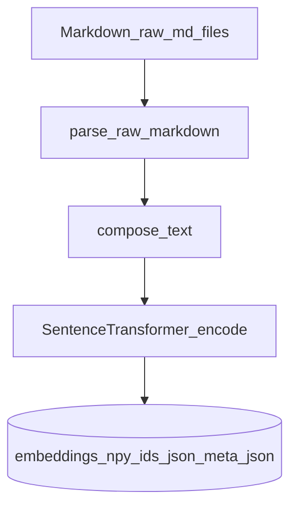

---
lat:
  require-code-mention: true
---
# Embeddings

Produces local SentenceTransformer embeddings of `title + summary` (fallback `title + description`) for every `Markdown/raw/<id>.md`, persisted as a numpy array plus aligned id and metadata files under `Markdown/embeddings/`.

This stage is the input for downstream clustering and taxonomy work over the user's watch history. It runs on CPU via [sentence-transformers](https://www.sbert.net/) (default model `sentence-transformers/all-MiniLM-L6-v2`, 384-dim) and is intentionally separate from [[markdown]]/[[summaries]]/[[transcripts]] so a fresh embedding pass can be re-run without touching the resumable SQLite caches.

## CLI entry

[[src/youtubebrain/embeddings.py#main]] is the `uv run embed` entry point: walk `Markdown/raw/`, embed every id not already in `ids.json`, save atomically.

The command is idempotent; safe to re-run after new raw files are added by `uv run markdown`. Progress logs go to `youtubebrain.log`; stdout is silent.

## Storage layout

[[src/youtubebrain/embeddings.py#save_atomic]] writes three files under `Markdown/embeddings/`: `embeddings.npy` (shape `(N, dim)`, `float32`, normalized), `ids.json` (a JSON list aligned row-for-row with the array), and `meta.json` (`{model, dim, updated_at}` with the model id used).

Atomic write protocol: each of the three files is first written to a `*.tmp` sibling, then `os.replace`-d into place. Order is `ids.json` → `meta.json` → `embeddings.npy` so a reader keying off the `.npy` file's presence always finds aligned id and meta sidecars. The invariant `len(ids) == arr.shape[0]` is enforced on save; [[src/youtubebrain/embeddings.py#load_existing]] reads the trio back and treats a length mismatch as "empty store" with a warning, forcing a clean rebuild on the next run.

## Model factory

[[src/youtubebrain/embeddings.py#_build_encoder]] imports `sentence_transformers.SentenceTransformer` lazily and returns a constructed encoder.

The lazy import keeps unit tests offline: tests monkeypatch `_build_encoder` with a deterministic stub so the third-party library is never imported during the default test run. [[src/youtubebrain/embeddings.py#_model_name]] resolves the model id from the `EMBEDDING_MODEL` env var (default `sentence-transformers/all-MiniLM-L6-v2`).

## Embed loop

[[src/youtubebrain/embeddings.py#embed_pending]] is the worker: load the existing store, walk `Markdown/raw/`, diff against the stored ids, encode the pending texts in a single `encoder.encode` call, vstack onto the existing array, and save atomically.

Raw markdown parsing and text composition are delegated to [[markdown#Parsing rules]], [[src/youtubebrain/markdown.py#iter_raw_files]], and [[markdown#Text composition]], so the writer/parser contract lives in one module.

The single `encode` call internally iterates over batches of `_BATCH_SIZE = 64`; it is not literally one forward pass when more than 64 new ids are pending. Encoding uses `batch_size=64`, `normalize_embeddings=True`, `convert_to_numpy=True`, then casts to `float32` so on-disk size is half what numpy would default to and downstream cosine similarity is a plain dot product. If the new vectors' dim differs from the existing store's, the loop raises `ValueError` without writing — the user must delete `Markdown/embeddings/` to rebuild under a new model.

## Env vars

[[src/youtubebrain/embeddings.py#_model_name]] reads `EMBEDDING_MODEL` (default `sentence-transformers/all-MiniLM-L6-v2`) after [[src/youtubebrain/config.py#load_env]]; it is the only env var this stage consumes.

`EMBEDDING_BATCH_SIZE` is deliberately not exposed. The hardcoded `_BATCH_SIZE = 64` is the sensible CPU sweet spot for MiniLM-class models on watch histories of 500–10K rows, and adding a knob with no current consumer would only widen the test surface.

## Re-embed policy

Embed once, never re-embed: [[src/youtubebrain/embeddings.py#embed_pending]] only encodes ids absent from `ids.json`, so a later edit to a video's summary does not regenerate its row automatically.

To force a full rebuild — for example after switching `EMBEDDING_MODEL` — delete the `Markdown/embeddings/` directory and re-run `uv run embed`.

## Tests

Pytest coverage for persistence, idempotency, env override, atomic write behavior, and dim-mismatch refusal; each leaf below maps to one `# @lat:` comment in `tests/test_embeddings.py`.

### ids.json round-trip

`save_atomic` followed by `load_existing` returns the same ids list, meta dict, and array as written.

### embeddings.npy shape and dtype

The persisted numpy file is `float32` with shape `(N, dim)`.

### meta.json records model and dim

After `embed_pending`, `meta.json` contains the model id, dim, and an `updated_at` timestamp.

### EMBEDDING_MODEL env override

Setting `EMBEDDING_MODEL` forwards the value to `_build_encoder` instead of the default.

### Idempotent re-run

A second `embed_pending` run over unchanged raw markdown encodes zero new texts and leaves `ids.json` unchanged.

### Skips videos with no embeddable text

A raw markdown file with both Summary and Description set to the unavailable placeholder is not added to `ids.json`.

### Atomic write leaves no partial files on crash

When `np.save` raises mid-write, no `*.tmp` siblings remain in the embeddings dir and no partial `embeddings.npy` is created.

### Dim mismatch raises

When the encoder returns vectors of a different dim than the existing store, `embed_pending` raises `ValueError` mentioning "dim" and leaves the existing files unchanged.

### Real encoder smoke

A `slow_embedding`-marked test downloads the real `all-MiniLM-L6-v2` model and verifies `(1, 384)` output for one encoded sentence; skipped by default via the `pytest.ini_options.addopts` filter.
