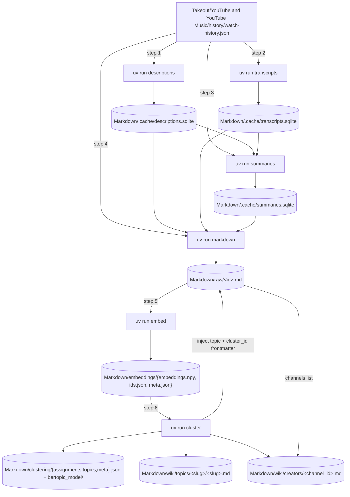

# Overview

This pipeline turns a Google Takeout YouTube watch history into a clustered, LLM-labelled local wiki.

The primary input is `Takeout/YouTube and YouTube Music/history/watch-history.json` (gitignored), produced by exporting YouTube history from [Google Takeout](https://takeout.google.com). Everything under `Markdown/` is derived from that file.

## Run order

Eight steps run end to end: six Python tools (steps 1–6), then wiki compile (step 7) and optional search indexing (step 8).

1. `uv run descriptions` — fetches YouTube Data API descriptions into `Markdown/.cache/descriptions.sqlite`.
2. `uv run transcripts` — long-running caption fetcher into `Markdown/.cache/transcripts.sqlite` (may run in parallel with step 1).
3. `uv run summaries` — long-running LLM summarizer into `Markdown/.cache/summaries.sqlite`, reading descriptions + transcripts caches.
4. `uv run markdown` — compiles `Markdown/raw/<id>.md` from Takeout metadata plus all three caches.
5. `uv run embed` — encodes `title + summary` (fallback `title + description`) into `Markdown/embeddings/`.
6. `uv run cluster` — BERTopic + LLM labels over embeddings; writes clustering artifacts and wiki seed pages.
7. `./compile-wiki.sh` — runs the Pi agent in Docker to enrich seeded topic pages (see [[wiki]]).
8. `./index-wiki.sh` — optional qmd indexing + MCP registration over curated wiki pages (see [[search]]).

### Prerequisites per stage

This table lists hard requirements and soft fallbacks for each Python stage.

| Stage | Hard inputs | Soft inputs | Outputs |
| --- | --- | --- | --- |
| 1. `descriptions` | `Takeout/.../watch-history.json`; `API_KEY_YOUTUBE` when pending rows exist | Existing `Markdown/.cache/descriptions.sqlite` rows (resumable) | `Markdown/.cache/descriptions.sqlite` |
| 2. `transcripts` | `Takeout/.../watch-history.json` | Existing `Markdown/.cache/transcripts.sqlite` rows (resumable) | `Markdown/.cache/transcripts.sqlite` |
| 3. `summaries` | `Takeout/.../watch-history.json`; reachable provider from `PROVIDER` / `MODEL` | `Markdown/.cache/descriptions.sqlite`; `Markdown/.cache/transcripts.sqlite` | `Markdown/.cache/summaries.sqlite` |
| 4. `markdown` | `Takeout/.../watch-history.json` | `Markdown/.cache/{descriptions.sqlite, transcripts.sqlite, summaries.sqlite}` | `Markdown/raw/<id>.md` |
| 5. `embed` | `Markdown/raw/<id>.md` (at least one parseable file with embeddable text) | Existing `Markdown/embeddings/{embeddings.npy, ids.json, meta.json}` for incremental runs | `Markdown/embeddings/{embeddings.npy, ids.json, meta.json}` |
| 6. `cluster` | `Markdown/embeddings/{embeddings.npy, ids.json, meta.json}`; reachable provider from `PROVIDER` / `MODEL` | `Markdown/raw/<id>.md` for representative text/titles/channels (missing files are skipped) | `Markdown/clustering/{assignments,topics,meta}.json` + `bertopic_model/`; `Markdown/wiki/topics/<slug>/<slug>.md`; `Markdown/wiki/creators/<channel_id>.md`; injects `topic` + `cluster_id` into raw frontmatter |

Steps 7–8 prerequisites (Docker + `.env.pi`, and qmd + Node) are documented in [[wiki]] and [[search]].

The soft-input contract is stage-specific: missing description/transcript/summary rows become placeholders in [[markdown#Markdown writer]], and missing summary content can produce `skipped` rows in [[summaries#Skipped when no content]].

## Workflow diagram

The diagram shows the canonical six-step Python flow using only required edges.

Steps 7–8 are intentionally excluded from this graph; see [[wiki]] and [[search]].

## Stage details

One section per stage clarifies required inputs, optional fallbacks, and persisted outputs.

### 1. descriptions

[[src/youtubebrain/descriptions.py#main]] populates the descriptions cache from Takeout video IDs via the YouTube Data API.

Hard reads: `Takeout/.../watch-history.json`; `API_KEY_YOUTUBE` only when pending/error rows exist.
Soft reads: existing rows in `Markdown/.cache/descriptions.sqlite` (idempotent resumability).
Writes: `Markdown/.cache/descriptions.sqlite` (`status` in `pending|ok|missing|error`).
Details: [[descriptions]], [[takeout]].

### 2. transcripts

[[src/youtubebrain/transcripts.py#main]] fetches captions with fallback resolvers and stores terminal/retryable states in SQLite.

Hard reads: `Takeout/.../watch-history.json`.
Soft reads: existing rows in `Markdown/.cache/transcripts.sqlite` (resumable, deduped enqueue).
Writes: `Markdown/.cache/transcripts.sqlite` (`status` in `pending|ok|no_captions|unavailable|age_restricted|blocked|error`).
Details: [[transcripts]].

### 3. summaries

[[src/youtubebrain/summaries.py#main]] summarizes videos with a pydantic-ai agent and stores results in SQLite.

Hard reads: `Takeout/.../watch-history.json`; reachable model from [[provider#Model factory]].
Soft reads: `Markdown/.cache/descriptions.sqlite` + `Markdown/.cache/transcripts.sqlite`.
Writes: `Markdown/.cache/summaries.sqlite` (`status` in `pending|ok|skipped|error`).
Details: [[summaries]], [[provider]].

### 4. markdown

[[src/youtubebrain/markdown.py#main]] compiles raw markdown files by combining Takeout metadata with cache read APIs.

Hard reads: `Takeout/.../watch-history.json`.
Soft reads: `Markdown/.cache/{descriptions.sqlite, transcripts.sqlite, summaries.sqlite}`.
Writes: `Markdown/raw/<video_id>.md` with YAML frontmatter and Summary/Description/Transcript sections.
Details: [[markdown]].

### 5. embed

[[src/youtubebrain/embeddings.py#main]] embeds raw markdown prose into a persistent float32 vector store.

Hard reads: `Markdown/raw/<id>.md` with at least one embeddable document.
Soft reads: existing `Markdown/embeddings/{embeddings.npy, ids.json, meta.json}` for incremental-only encoding.
Writes: `Markdown/embeddings/{embeddings.npy, ids.json, meta.json}`.
Details: [[embeddings]].

### 6. cluster

[[src/youtubebrain/clusters.py#main]] clusters embeddings and labels each cluster before seeding wiki topic/creator pages.

Hard reads: `Markdown/embeddings/{embeddings.npy, ids.json, meta.json}`; reachable provider from `PROVIDER` / `MODEL`.
Soft reads: `Markdown/raw/<id>.md` for representative text, titles, and channel metadata.
Writes: `Markdown/clustering/{assignments.json, topics.json, meta.json}` + `bertopic_model/`; `Markdown/wiki/topics/`; `Markdown/wiki/creators/`; updates raw frontmatter with `topic` + `cluster_id`.
Details: [[clusters]].

### 7. compile-wiki

`./compile-wiki.sh` enriches seeded topic pages into full syntheses via the Pi sandbox.

Hard reads: seeded `Markdown/wiki/topics/<slug>/<slug>.md`; Docker runtime; `.env.pi`.
Soft reads: existing enriched pages (`last_updated` marker skips already-filled pages).
Writes: enriched pages in `Markdown/wiki/topics/`, plus `Markdown/wiki/index.md` and `Markdown/wiki/log.md`.
Details: [[wiki]].

### 8. index-wiki (optional)

`./index-wiki.sh` indexes curated wiki pages into qmd and refreshes MCP-facing search metadata.

Hard reads: compiled wiki pages; qmd binary (2.1.0+).
Soft reads: existing `.qmd/` index for resumable update/embed passes.
Writes: `.qmd/qmd/index.sqlite` and updated qmd collection/context state.
Details: [[search]].
