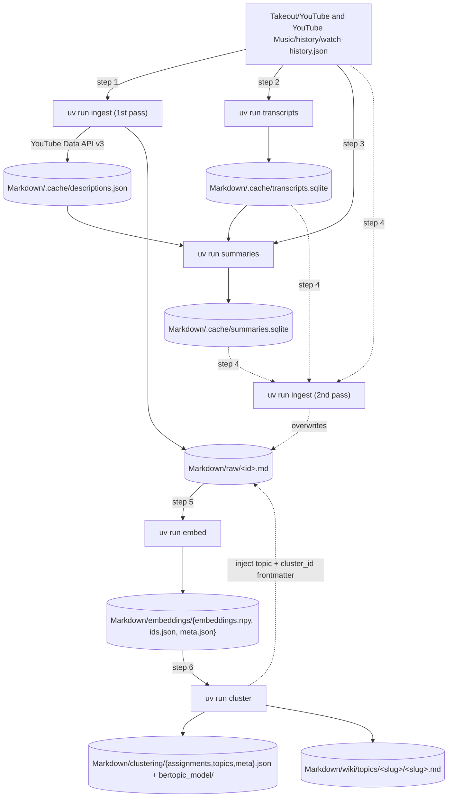

# Overview

End-to-end pipeline that turns a Google Takeout YouTube watch history into a clustered, LLM-labelled local wiki of every video the user has watched.

The primary input is `Takeout/YouTube and YouTube Music/history/watch-history.json` (gitignored), produced by exporting YouTube history from [Google Takeout](https://takeout.google.com). All other artefacts under `Markdown/` are derived from it by the five CLI tools below.

## Run order

Six invocations across five tools — `ingest` is run twice because it both *seeds* the descriptions cache the summarizer needs and *folds* the resulting transcripts and summaries back into the raw markdown that the embedder reads.

1. `uv run ingest` — first pass; fetches video descriptions via the YouTube Data API and writes `Markdown/raw/<id>.md` files whose Summary and Transcript sections are still `_(unavailable)_`.
2. `uv run transcripts` — overnight worker that fills `Markdown/.cache/transcripts.sqlite`. Independent of step 1; may run in parallel.
3. `uv run summaries` — overnight LLM worker that reads `Markdown/.cache/descriptions.json` from step 1 and `Markdown/.cache/transcripts.sqlite` from step 2, and fills `Markdown/.cache/summaries.sqlite`.
4. `uv run ingest` — second pass; same command, but now the transcripts and summaries caches are populated, so the re-written `Markdown/raw/<id>.md` files contain real Summary and Transcript text. This step is required for the next stage to embed prose instead of placeholders.
5. `uv run embed` — encodes `title + summary` (fallback `title + description`) into `Markdown/embeddings/`.
6. `uv run cluster` — UMAP + HDBSCAN via BERTopic over the embedding store, with one LLM call per cluster; writes `Markdown/clustering/` and `Markdown/wiki/topics/`.

### Prerequisites per stage

Each row lists what must exist on disk before the tool will produce a useful result. Hard inputs cause an error if missing; soft inputs gracefully degrade to `_(unavailable)_` placeholders or `None` lookups.

| Stage             | Hard inputs                                                                | Soft inputs                                                                              | Outputs                                                                                                                          |
| ----------------- | -------------------------------------------------------------------------- | ---------------------------------------------------------------------------------------- | -------------------------------------------------------------------------------------------------------------------------------- |
| 1. `ingest`       | `Takeout/.../watch-history.json`, `API_KEY_YOUTUBE` env var                | `Markdown/.cache/{transcripts.sqlite, summaries.sqlite}`                                 | `Markdown/raw/<id>.md`, `Markdown/.cache/descriptions.json`                                                                      |
| 2. `transcripts`  | `Takeout/.../watch-history.json`                                           | —                                                                                        | `Markdown/.cache/transcripts.sqlite`                                                                                             |
| 3. `summaries`    | `Takeout/.../watch-history.json`, configured `PROVIDER`/`MODEL`            | `Markdown/.cache/descriptions.json`, `Markdown/.cache/transcripts.sqlite`                | `Markdown/.cache/summaries.sqlite`                                                                                               |
| 4. `ingest` (re-run) | same as step 1                                                          | `Markdown/.cache/{transcripts.sqlite, summaries.sqlite}` now populated                   | overwrites `Markdown/raw/<id>.md` with Summary + Transcript bodies                                                               |
| 5. `embed`        | `Markdown/raw/<id>.md` (at least one file)                                 | —                                                                                        | `Markdown/embeddings/{embeddings.npy, ids.json, meta.json}`                                                                      |
| 6. `cluster`      | `Markdown/embeddings/{embeddings.npy, ids.json, meta.json}`                | `Markdown/raw/<id>.md` (used for representative-doc titles; missing files do not abort)  | `Markdown/clustering/{assignments,topics,meta}.json` + `bertopic_model/`; `Markdown/wiki/topics/<slug>/<slug>.md`; injects `topic` + `cluster_id` into each raw markdown |

The "soft input" column documents the implementation contract: each tool reads these paths if present but works without them — see [[ingest#Markdown writer]] for the placeholder rendering, [[transcripts#Read API]] and [[summaries#Read API]] for the missing-DB-returns-None contract, and [[summaries#Skipped when no content]] for the path where missing description + missing transcript produces a `skipped` row.

## Workflow diagram

The diagram shows the canonical six-step path: solid arrows are required edges, dotted arrows mark the step-4 re-ingest that folds the caches into raw markdown.

## Stage details

One section per tool, listing the underlying entry point, what it reads, and what it writes. Reads are split into hard requirements (raises if missing) and soft lookups (graceful fallback) per the table above.

### 1. ingest

[[src/youtubebrain/ingest.py#main]] reads `watch-history.json`, drops non-watch and unresolved records, fetches missing video descriptions via the YouTube Data API v3, and writes one markdown file per watched video.

Hard reads: `Takeout/YouTube and YouTube Music/history/watch-history.json`; `API_KEY_YOUTUBE` env var resolved by [[descriptions#API key requirement]] whenever the descriptions cache has misses.
Soft reads: `Markdown/.cache/descriptions.json` (own cache), `Markdown/.cache/transcripts.sqlite` (via [[transcripts#Read API]]), `Markdown/.cache/summaries.sqlite` (via [[summaries#Read API]]).
Writes: `Markdown/raw/<video_id>.md` (YAML frontmatter + Summary / Description / Transcript sections), `Markdown/.cache/descriptions.json` (updated atomically after each batch).
Details: [[ingest]], [[descriptions]].

### 2. transcripts

[[src/youtubebrain/transcripts.py#main]] is the slow overnight worker that fetches captions via youtube-transcript-api with yt-dlp and pytubefix fallbacks, storing every outcome in SQLite for resumability.

Hard reads: `Takeout/YouTube and YouTube Music/history/watch-history.json` (for the id list).
Soft reads: existing rows in `Markdown/.cache/transcripts.sqlite` (resumes from prior partial run; `INSERT OR IGNORE` leaves completed rows untouched).
Writes: `Markdown/.cache/transcripts.sqlite` (one row per video id, `status` ∈ {`pending`, `ok`, `no_captions`, `unavailable`, `age_restricted`, `blocked`, `error`}).
Details: [[transcripts]].

### 3. summaries

[[src/youtubebrain/summaries.py#main]] generates one short LLM summary per video from `(title + description + transcript)` via a pydantic-ai agent (Ollama by default, configurable through [[provider]]), and persists every outcome to SQLite.

Hard reads: `Takeout/YouTube and YouTube Music/history/watch-history.json`; a reachable LLM provider per `PROVIDER` / `MODEL` (raises during `agent.run` if unreachable).
Soft reads: `Markdown/.cache/descriptions.json` (missing → empty dict; videos without a cached description fall back to title + transcript), `Markdown/.cache/transcripts.sqlite` (missing → all ids map to `None`; videos with neither description nor transcript become `status='skipped'`).
Writes: `Markdown/.cache/summaries.sqlite` (`status` ∈ {`pending`, `ok`, `skipped`, `error`}).
Details: [[summaries]], [[provider]].

### 4. ingest (re-run)

A second `uv run ingest` invocation. The command is the same as step 1; the difference is that the transcripts and summaries caches are now populated, so the markdown writer folds them in.

Hard reads: same as step 1.
Soft reads: `Markdown/.cache/transcripts.sqlite` and `Markdown/.cache/summaries.sqlite` now contain rows for most ids; `_(unavailable)_` placeholders persist only for ids whose row is non-`ok`.
Writes: overwrites every `Markdown/raw/<video_id>.md` in place (idempotent per [[ingest#Markdown writer]]).
Details: [[ingest#Markdown writer]].

### 5. embed

[[src/youtubebrain/embeddings.py#main]] walks `Markdown/raw/`, encodes `title + summary` (fallback `title + description`) with a local SentenceTransformer model, and writes a normalized float32 embedding store.

Hard reads: `Markdown/raw/<id>.md` (at least one parseable file with embeddable text per [[embeddings#Text composition]]).
Soft reads: existing `Markdown/embeddings/{embeddings.npy, ids.json, meta.json}` for incremental encoding (only ids absent from `ids.json` are encoded; see [[embeddings#Re-embed policy]]).
Writes: `Markdown/embeddings/embeddings.npy` (shape `(N, dim)`, float32, L2-normalized), `Markdown/embeddings/ids.json` (row-aligned id list), `Markdown/embeddings/meta.json` (`{model, dim, updated_at}`).
Details: [[embeddings]].

### 6. cluster

[[src/youtubebrain/clusters.py#main]] reduces the embedding store with UMAP, clusters with HDBSCAN via BERTopic, then issues one LLM call per cluster to produce a human-readable kebab-case label + description, and finally materialises every cluster as a wiki page.

Hard reads: `Markdown/embeddings/{embeddings.npy, ids.json, meta.json}` (raises `ValueError("no embeddings ...")` if missing or empty; raises `ValueError("embedding model changed ...")` if `embeddings/meta.json.model` differs from a prior `clustering/meta.json.embedding_model`); reachable LLM provider per `PROVIDER` / `MODEL`.
Soft reads: `Markdown/raw/<id>.md` (used by [[clusters#Representative-doc plumbing]] to recover titles and rep-doc texts; missing files do not abort the run).
Writes: `Markdown/clustering/{assignments.json, topics.json, meta.json}` + `Markdown/clustering/bertopic_model/`, `Markdown/wiki/topics/<slug>/<slug>.md` (one page per cluster including a synthetic `outliers` page when present), and injects `topic` + `cluster_id` into every `Markdown/raw/<id>.md` frontmatter.
Details: [[clusters]].
