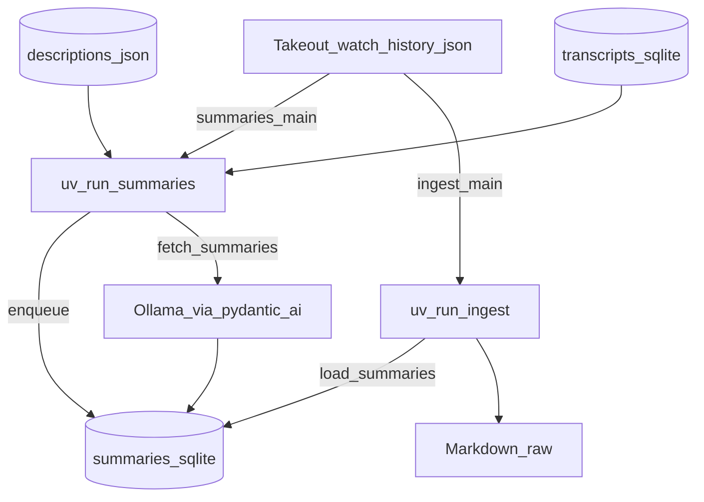

---
lat:
  require-code-mention: true
---
# Summaries

Generates per-video summaries via a local Ollama model, stores them in SQLite for resumable runs, and exposes plain text for [[ingest#Markdown writer]] via [[summaries#Read API]].

The pipeline mirrors [[transcripts]]: a slow fetcher persists durable state, while [[src/youtubebrain/ingest.py#main]] stays fast by only reading the cache when writing `Markdown/raw/<video_id>.md`. Summaries synthesise title, description, and transcript; sponsorship and merch boilerplate are ignored by prompt instruction, not regex stripping.

## CLI entry

[[src/youtubebrain/summaries.py#main]] is the `uv run summaries` entry point: Takeout IDs, enqueue, then the async fetch loop.

It lazy-imports [[ingest#Loader]] helpers (`WATCH_HISTORY_PATH`, `load_watch_history`, `_video_id`) inside [[src/youtubebrain/summaries.py#_main_async]] to avoid import cycles with [[src/youtubebrain/ingest.py#main]], which imports [[src/youtubebrain/summaries.py#load_summaries]].

## SQLite schema

[[src/youtubebrain/summaries.py#init_db]] ensures `Markdown/.cache/` exists, opens `summaries.sqlite`, sets WAL via `PRAGMA journal_mode=WAL`, and creates the `summaries` table plus `idx_summaries_status` on `status` if missing.

Each row is keyed by `video_id`. `status` drives resumability: `pending` (queued), `ok` (summary ready for markdown), `skipped` (no description or transcript to summarize), and `error` (LLM or transport failure; retried until `attempts` reaches the cap). `text` holds the summary body; `model` records which Ollama model produced an `ok` row. `error_message`, `fetched_at`, `last_attempt`, and `attempts` support debugging and caps.

## Enqueue

[[src/youtubebrain/summaries.py#enqueue]] deduplicates IDs, ensures the schema, and inserts pending rows with `INSERT OR IGNORE`.

Existing primary keys are left unchanged, so re-running after a partial night only adds new ids from an updated Takeout export without clobbering completed rows.

## Read API

[[src/youtubebrain/summaries.py#load_summaries]] is a synchronous, read-only lookup of plain `text` for ok rows.

If the database file is missing, every requested id maps to `None`. Otherwise ids are deduplicated, queried in chunks of 500, and only `status='ok'` rows return text so ingest can render `_(unavailable)_` for every other case.

## Fetch loop

[[src/youtubebrain/summaries.py#fetch_summaries]] runs the summarization worker: one video at a time, async LLM calls via pydantic-ai.

Row selection uses `WHERE status IN ('pending','error') AND attempts < 5` ordered by `attempts ASC` then `RANDOM() LIMIT 1`. Rows with `status='ok'` or `status='skipped'` never match again. On each iteration the loop loads titles from [[ingest#Loader]], descriptions from `Markdown/.cache/descriptions.json`, and transcripts via [[transcripts#Read API]], then calls [[src/youtubebrain/summaries.py#summarize_one]]. Successful rows store `text` and `model`; each commit logs `n_ok/n_total` and percent complete.

## Agent build

[[src/youtubebrain/summaries.py#_build_agent]] constructs a pydantic-ai `Agent` backed by a local Ollama model.

It reads `SUMMARY_MODEL` (default `qwen3:32b`) and `OLLAMA_BASE_URL` (default `http://localhost:11434/v1`) after `load_dotenv()`, builds `OllamaModel` with `OllamaProvider(base_url=...)`, and returns an `Agent` with `output_type=str`, the system prompt, and `retries=3`. The chosen model id is logged at startup.

## System prompt

The constant `SYSTEM_PROMPT` instructs the model to produce a concise multi-paragraph summary from `TITLE:`, `DESCRIPTION:`, and `TRANSCRIPT:` blocks in the user message.

It explicitly tells the model to disregard sponsorships, Patreon pitches, channel-membership pitches, merch-store mentions, hashtags, and sponsor read-outs inside transcripts, and to keep the summary to roughly two to four short paragraphs.

## Transcript truncation

[[src/youtubebrain/summaries.py#_truncate]] caps transcript input at `_TRANSCRIPT_CHAR_LIMIT` (12000 characters) before building the user prompt.

Longer transcripts are cut with a trailing `…[transcript truncated]` marker so prompts stay within Ollama's default `num_ctx` without requiring per-model context tuning.

## Skipped when no content

[[src/youtubebrain/summaries.py#summarize_one]] returns `('skipped', None, 'no content')` when both description and transcript are `None`.

Skipped rows are persisted and not retried by the fetch loop selection query.

## Re-summarize policy

Once a row reaches `status='ok'`, it is never selected again. The fetch loop only processes `pending` and `error` rows.

There is no input-hash or transcript-arrival re-summarize path: if a transcript appears later, delete or reset the row manually to regenerate.

## Tests

Pytest coverage for SQLite helpers, agent wiring, summarize_one branches, fetch loop persistence, and ingest markdown wiring; each leaf below maps to one `# @lat:` comment in `tests/test_summaries.py` or `tests/test_ingest.py`.

### Schema and enqueue idempotent

Verifies `init_db` creates the table and `idx_summaries_status` index.

### Enqueue inserts pending

Double `enqueue` leaves one pending row per unique id.

### load_summaries None for non-ok

Pending and error rows map to `None` for readers.

### load_summaries returns text for ok

Status `ok` returns the stored plain `text` field.

### Skipped when no content

Both description and transcript `None` yields `skipped` with message `no content`.

### summarize_one ok with stub agent

A stub `agent.run` returning output produces `ok` status and text.

### summarize_one error on exception

Agent exceptions map to `error` status with the exception string preserved.

### Transcript truncation marks suffix

Input over `_TRANSCRIPT_CHAR_LIMIT` includes the truncation marker suffix.

### Default model when env unset

With `SUMMARY_MODEL` unset, `OllamaModel` is constructed with `qwen3:32b`.

### SUMMARY_MODEL env override

`SUMMARY_MODEL=foo:bar` is passed through to `OllamaModel`.

### Fetch loop persists ok

A mocked fetch run writes `ok` text and records the model id with `attempts=1`.

### Fetch loop skipped without inputs

When description and transcript are both missing, the row becomes `skipped` without calling the agent.
