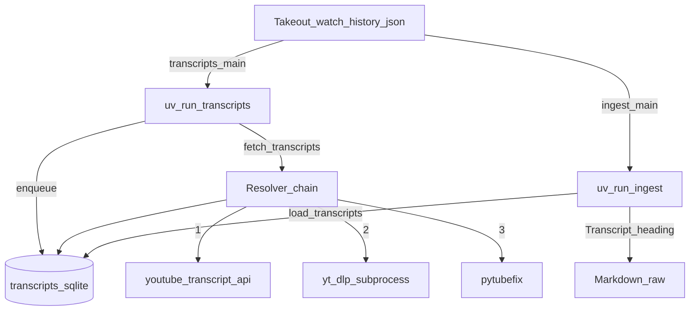

---
lat:
  require-code-mention: true
---
# Transcripts

Fetches captions outside the YouTube Data API, stores them in SQLite for resumable overnight runs, and exposes plain text for [[ingest#Markdown writer]] via [[transcripts#Read API]].

The pipeline mirrors [[descriptions]]: a slow fetcher persists durable state, while [[src/youtubebrain/ingest.py#main]] stays fast by only reading the cache when writing `Markdown/raw/<video_id>.md`. YouTube does not expose transcripts through the official Data API, so this path uses Innertube-style clients and optional fallbacks aligned with the project research plan.

## CLI entry

[[src/youtubebrain/transcripts.py#main]] is the `uv run transcripts` entry point: Takeout IDs, enqueue, then the fetch loop.

It imports [[ingest#Loader]] helpers (`WATCH_HISTORY_PATH`, `load_watch_history`), extracts ids with [[src/youtubebrain/ingest.py#_video_id]], calls [[src/youtubebrain/transcripts.py#init_db]] and [[src/youtubebrain/transcripts.py#enqueue]], then [[src/youtubebrain/transcripts.py#fetch_transcripts]]. It avoids a top-level `ingest` import to prevent cycles with [[src/youtubebrain/ingest.py#main]], which imports [[src/youtubebrain/transcripts.py#load_transcripts]].

## SQLite schema

[[src/youtubebrain/transcripts.py#init_db]] ensures `Markdown/.cache/` exists, opens `transcripts.sqlite`, sets WAL via `PRAGMA journal_mode=WAL`, and creates the `transcripts` table plus `idx_transcripts_status` on `status` if missing.

Each row is keyed by `video_id`. `status` drives resumability: typical values are `pending` (queued), `ok` (plain text ready for markdown), `no_captions` and `unavailable` (terminal, do not retry in the loop), `error` (transient or unknown; retried until `attempts` reaches the cap), `blocked` (IP or rate signal; not auto-selected until reset), and `age_restricted` (primary path could not auth; fallbacks failed). `language` and `is_generated` mirror the winning caption track. `text` holds joined plain words for [[ingest#Markdown writer]]; `raw_json` stores timed snippet JSON when available. `source` is `yta`, `yt-dlp`, or `pytubefix`. `error_message`, `fetched_at`, `last_attempt`, and `attempts` support debugging and caps.

## Enqueue

[[src/youtubebrain/transcripts.py#enqueue]] deduplicates IDs, ensures the schema, and inserts pending rows with `INSERT OR IGNORE`.

Existing primary keys are left unchanged, so re-running after a partial night only adds new ids from an updated Takeout export without clobbering completed or terminal rows.

## Read API

[[src/youtubebrain/transcripts.py#load_transcripts]] is a synchronous, read-only lookup of plain `text` for ok rows.

If the database file is missing, every requested id maps to `None`. Otherwise ids are deduplicated, queried in chunks of 500, and only `status='ok'` rows return text so ingest can render `_(unavailable)_` for every other case without extra branching.

## Fetch loop

[[src/youtubebrain/transcripts.py#fetch_transcripts]] runs the overnight worker: single-threaded, one video at a time, no pool of workers.

Row selection uses `WHERE status IN ('pending','error') AND attempts < 5` ordered by `attempts ASC` then `RANDOM() LIMIT 1`. Terminal rows (`ok`, `no_captions`, `unavailable`, `age_restricted`) never match again. **`blocked` is intentionally omitted** so a throttled IP does not immediately re-hit the same id; after cooldown, set `blocked` rows back to `pending` or `error` (or delete them) to retry. This differs from the original design sketch that included `blocked` in the `IN` list; the implementation favours not burning attempts on the same row while the IP is still hot.

On success, `_resolve_with_fallbacks` returns seven fields; the updater writes `status`, `language`, `text`, `raw_json`, `is_generated`, `error_message`, `source`, bumps `attempts`, and timestamps, then commits every row. After each `ok`, a counter drives an extra `random.uniform(60, 120)` second pause every 500 successes. Every completed iteration (success or terminal failure) sleeps `random.uniform(3, 7)` seconds via [[src/youtubebrain/transcripts.py#_sleep]] (monkeypatched in tests).

On `BlockedError` from [[src/youtubebrain/transcripts.py#fetch_transcripts]], the row is set to `blocked`, `attempts` increments, and the process sleeps `BACKOFFS[consecutive_blocks - 1]` seconds (300, 900, 2700, 7200). After four consecutive blocks across iterations, the loop logs and stops so you can resume later without hammering YouTube.

## Fallback chain

Resolution is implemented by [[src/youtubebrain/transcripts.py#_resolve_with_fallbacks]] (and exposed for tests as [[src/youtubebrain/transcripts.py#resolve_transcript]]). It always tries the primary API first, then conditionally heavier paths.

**Primary — [[src/youtubebrain/transcripts.py#_try_yta]].** Builds a `YouTubeTranscriptApi` instance (from the `youtube-transcript-api` package) with a shared [[src/youtubebrain/transcripts.py#_YtaSessionState]] that recreates a `requests.Session` with a random desktop User-Agent from `UA_POOL` every `_SESSION_RECYCLE_EVERY` (300) calls. Calls `fetch` with `LANGS` `en`, `en-US`, `en-GB`, `a.en`. On `NoTranscriptFound`, attempts `list` → `find_transcript` → `translate('en')` → `fetch`. Outcomes: success yields `_ResolvedOk` with `to_raw_data()` JSON and joined plain text via [[src/youtubebrain/transcripts.py#_snippets_to_text]]; `TranscriptsDisabled` or exhausted translation → terminal `no_captions`; `VideoUnavailable` → `unavailable`; `AgeRestricted` or `PoTokenRequired` → `('fallback', 'age'|'pot')` for the next stage; `RequestBlocked` / `IpBlocked` → raise `BlockedError`; other `CouldNotRetrieveTranscript` subclasses → terminal `error` string for retry.

**Second — [[src/youtubebrain/transcripts.py#_try_ytdlp]].** Resolves `yt-dlp` on `PATH` with `shutil.which`, writes subtitles under a temp directory, `--sub-format json3/best`, sleeps between requests and subtitle fetches, and `player_client=tv,mweb`. Parses the first `*.json3` with [[src/youtubebrain/transcripts.py#_json3_file_to_text]]. Stdout/stderr containing `HTTP Error 429` or `Too Many Requests` returns the sentinel `blocked`, which becomes `BlockedError` upstream. Missing or empty JSON3 yields `fallback` so pytubefix can run. A local **bgutil** PO-token provider on `127.0.0.1:4416` is not configured in code; current `yt-dlp` can still pick it up via its own plugin discovery if you run the provider separately.

**Third — [[src/youtubebrain/transcripts.py#_try_pytubefix]].** Instantiates `YouTube(..., use_po_token=True)`, prefers caption keys `a.en` then `en`, reads [[src/youtubebrain/transcripts.py#_xml_captions_to_plain]] from `xml_captions`, and stores a coarse single-snippet `raw_json` when yt-dlp left only a blob.

If the first stage signalled `age` and both fallbacks fail, status is `age_restricted` with the last error message. Otherwise the last non-ok status propagates (often `error`).

## Tests

Pytest coverage for SQLite helpers, resolver fallbacks, fetch pacing hooks, and ingest markdown wiring; each leaf below maps to one `# @lat:` comment in `tests/test_transcripts.py` or `tests/test_ingest.py`.

### Schema and enqueue idempotent

Verifies `init_db` plus double `enqueue` leaves one pending row per unique id.

### load_transcripts None for non-ok

A non-ok row with hidden text still maps to `None` for readers.

### load_transcripts returns text for ok

Status `ok` returns the stored plain `text` field.

### Primary ok persists yta fields

A mocked resolver writing `ok` persists `language`, `text`, `raw_json`, and `source` including `yta`.

### TranscriptsDisabled terminal

Mocked yta terminal `no_captions` does not invoke fallbacks.

### VideoUnavailable terminal

Mocked yta terminal `unavailable` maps through unchanged.

### RequestBlocked backoff path

One `BlockedError` marks `blocked`, increments attempts once, and records the first backoff sleep duration.

### Consecutive blocks abort

Four consecutive blocks across distinct pending rows stop the loop with one row still pending.

### PoTokenRequired uses yt-dlp

Fallback `pot` invokes yt-dlp mock before pytubefix.

### yt-dlp JSON3 plain text

`_json3_file_to_text` concatenates utf8 segments.

### pytubefix only after yt-dlp fallback

When yt-dlp returns `fallback`, the pytubefix mock runs third.

### Attempts cap at five

Rows already at five attempts are never passed to the resolver again.

### Ingest markdown Transcript section

`_render_markdown` includes `## Transcript` with supplied body text.

### Ingest transcript unavailable placeholder

`None` transcript renders `_(unavailable)_` under Transcript.

### Ingest main folds transcripts

`main` passes stubbed transcript strings into written markdown files.
